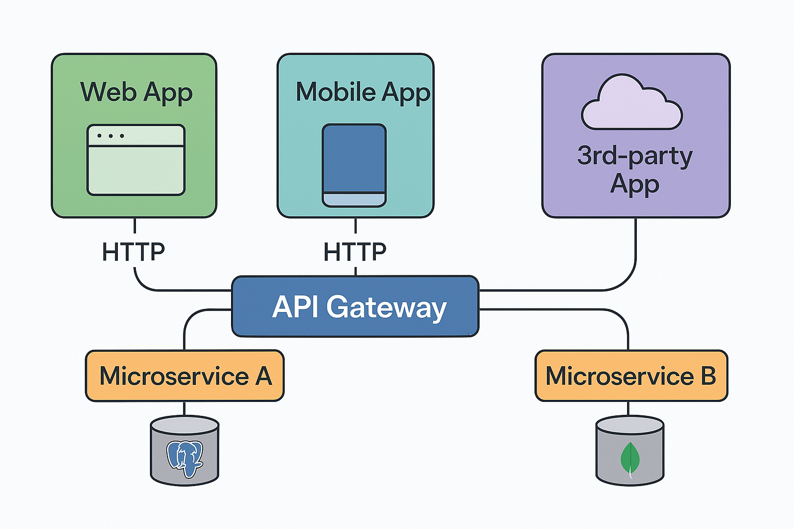

# Kiến trúc tổng thể

Hệ thống Ecoma được tổ chức theo mô hình **microservices**. Các service giao tiếp với nhau qua message broker, chia sẻ schema rõ ràng. Mỗi service sử dụng database riêng biệt và các infrastructure riêng biệt nếu có thể để đảm bảo khả năng hoạt động độc lập.

  

## Mô hình giao tiếp

| Loại giao tiếp     | Sử dụng khi                                   | Công nghệ |
| ------------------ | --------------------------------------------- | --------- |
| HTTP               | Từ frontend đến gateway                       | REST      |
| RPC nội bộ         | Giao tiếp đồng bộ giữa các service            | NATS      |
| Event / Task Queue | Giao tiếp bất đồng bộ (dịch, thông báo, v.v.) | RabbitMQ  |

### Cơ chế giao tiếp

- Các site như `accounts-site`, `home-site`, `app-site`, `admin-site` là các app frontend riêng biệt và độc lập
- `api-gateway-service` đóng vai trò là frontend for backend. Là cổng giao tiếp duy nhất giữa frontend/mobile app với backend.
- Mỗi service tương ứng với một **bounded context** rõ ràng.
- Giảm thiểu coppleing thông qua:
  - Sử dụng **NATS** làm message broker để giao tiếp
  - Mỗi service sẽ được triển khai với infras độc lập (database, cache, queue)

### Cơ chế triển khai

- CI/CD sử dụng GitHub Actions kết hợp ArgoCD để tự động build và deploy các services và frontend applications sẽ được đóng gói thành các docker containers
- Ở trên môi trường dev hệ thống sẽ được triển khai với docker-compose
- Tất cả cấu hình hạ tầng trên môi trường production sẽ được quản lý qua **Helm Chart**.

## Các thành phần hệ thống

### Web applications

| Application       | Mô tả ngắn                                 |
| ----------------- | ------------------------------------------ |
| **accounts-site** | Trang quản lý tài khoản người dùng và auth |
| **home-site**     | Trang chủ của hệ thống                     |
| **app-site**      | Giao diện chính của hệ thống SaaS          |
| **admin-site**    | Giao diện quản trị                         |

### Microservices

| Service                  | Domain đảm nhiệm                                  |
| ------------------------ | ------------------------------------------------- |
| **api-gateway-service**  | Cổng HTTP trung gian giữa frontend và các service |
| **iam-service**          | Xác thực và phiên người dùng                      |
| **user-service**         | Quản lý tài khoản người dùng                      |
| **organization-service** | Quản lý tổ chức organization                      |
| **feature-service**      | Hệ thống feature và permission của feature        |
| **i18n-service**         | Quản lý ngôn ngữ tập trung                        |
| **translate-service**    | Dịch các từ khóa bằng external API                |
| **notification-service** | Gửi thông báo qua email, SMS, push                |
| **product-service**      | Quản lý thông tin sản phẩm                        |

### Infrastructure Apps

| Service   | Domain đảm nhiệm                               |
| --------- | ---------------------------------------------- |
| **icons** | Cung cấp các file SVG dùng chung (fontawesome) |
